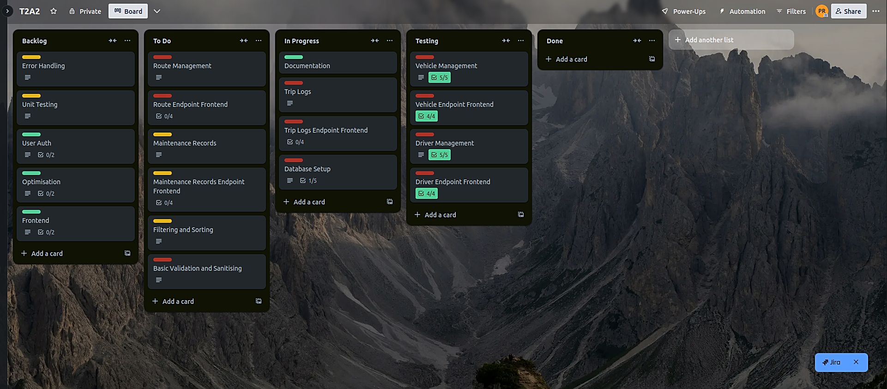
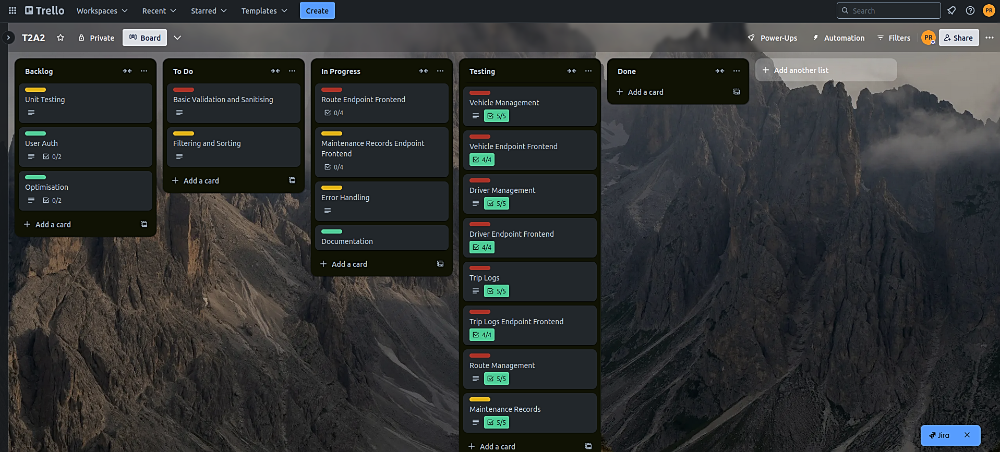
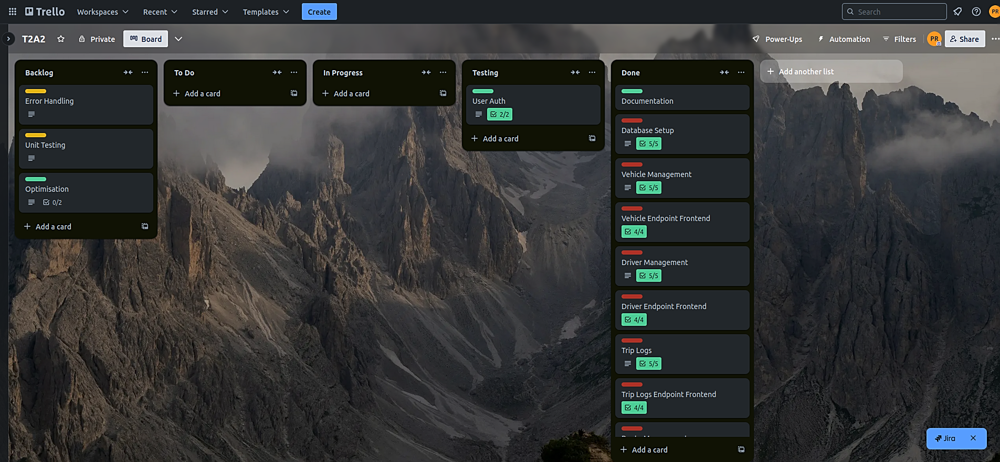
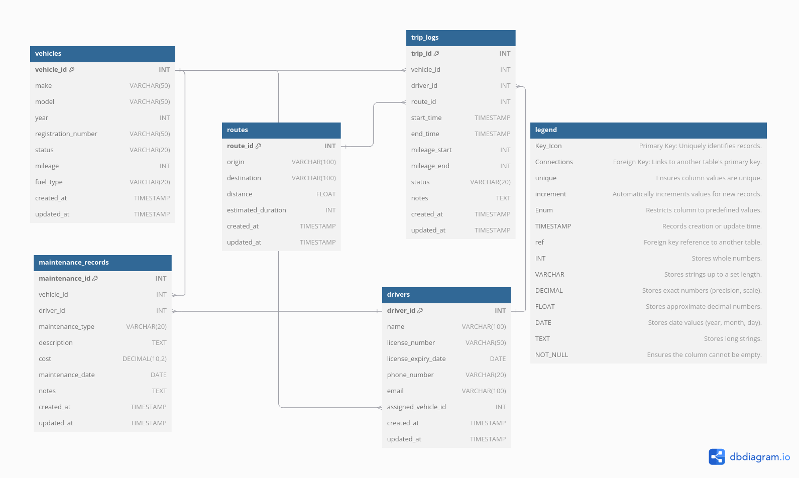

# FleetSentinel

## Set Up

Change the variables in the .env file to your liking if you want to (if you receive this as a zip file and not on git). 

The command to migrate the databases so that you can have the same DB infrastructure on your local system is:

```bash
alembic revision --autogenerate -m"initial db setup"
```

and then:

```bash
python3 scripts/load_env.py && alembic upgrade head
```

The first user created on the local database will automatically be the admin, this is the only user that can register other users.

## Mission Statement

FleetSentinel addresses inefficiencies in fleet management, focusing on centralising vehicle data and maintenance tracking. Australian fleets can lose up to $760 per day due to vehicle downtime, with unexpected breakdowns contributing significantly to this cost. Research shows that preventative maintenance can reduce downtime by 20%, further cutting operational costs.

The current version of FleetSentinel offers an API that streamlines the management of vehicle data and maintenance logs. It provides fleet managers with tools to track vehicle status, log maintenance activities, and ensure compliance with service schedules, reducing manual tracking errors. By automating these processes, FleetSentinel helps minimise unplanned downtime and maintenance-related disruptions, ensuring smoother operations without introducing advanced features like GPS tracking or predictive maintenance yet.

This solution is designed to improve fleet reliability and reduce downtime, giving businesses a solid foundation for scaling their operations while preparing for future enhancements like GPS integration and route optimisation.

#### *references*:
https://www.chevinfleet.com/en-au/learning-zone/the-real-cost-of-vehicle-downtime-for-your-fleet/

https://www.toyota.com.au/fleet/business-guide/total-cost-of-ownership

## Project Management

Tasks in the FleetSentinel project are planned using a structured approach that involves breaking down the development process into small, manageable tasks. These tasks are tracked using the project management tool, Trello. Each task is assigned a priority level and a due date, with progress tracked through stages such as 'To Do', 'In Progress', and 'Completed'.

### Initial Board


### During Project



### During Project 2



### Final Board



### Dependencies

Flask

Flask is a lightweight WSGI web framework for Python, managing HTTP requests, routing, and template rendering. It serves as the core framework in the application, handling the request-response cycle and enabling dynamic web pages. Flask integrates well with other libraries and extensions, allowing the project to scale from simple to complex use cases.

https://flask.palletsprojects.com/en/3.0.x/

SQLAlchemy

SQLAlchemy is an ORM library and SQL toolkit for Python, abstracting database interactions and enabling CRUD operations through Python objects without the need to write raw SQL. It handles all database transactions in the application and supports advanced querying and table relationships. SQLAlchemy works seamlessly with PostgreSQL through psycopg2-binary and integrates with Alembic for managing schema migrations.

https://www.sqlalchemy.org/

psycopg2-binary

psycopg2-binary is a PostgreSQL adapter for Python, ensuring efficient communication between Flask and PostgreSQL. It enables SQL queries, data retrieval, and transaction management. The "binary" version simplifies installation by providing a pre-compiled package, making it easier to manage PostgreSQL connections within the application.

https://pypi.org/project/psycopg2-binary/

Alembic

Alembic is a database migration tool built for use with SQLAlchemy. It tracks schema changes, allowing controlled updates such as creating or altering tables and columns. Alembic ensures that the database remains consistent across versions, managing schema versioning and supporting rollback when necessary.

https://alembic.sqlalchemy.org/en/latest/

python-dotenv

python-dotenv is used to manage environment variables, loading them from a .env file into the application environment. This keeps sensitive data like database credentials and API keys secure and separate from the source code, simplifying deployment across environments such as development and production.

https://pypi.org/project/python-dotenv/

pyjwt

pyjwt is a library for encoding, decoding, and verifying JSON Web Tokens (JWT). It is used for user authentication by generating tokens that identify users and manage their access to protected resources in the application. JWTs provide secure, stateless communication between the server and clients.

https://pyjwt.readthedocs.io/en/stable/

Flask-JWT-Extended

Flask-JWT-Extended is an extension for Flask that adds enhanced JWT support. It includes features like token refreshing, revocation, and access control based on user roles. This extension ensures that only authenticated users can access certain routes and resources, managing token lifecycles and securing the application’s authentication system.

https://flask-jwt-extended.readthedocs.io/en/stable/

These dependencies work together to handle web routing, database communication, secure authentication, and configuration within the application.

### Database

The database system chosen for FleetSentinel is PostgreSQL, an open-source relational database management system. PostgreSQL offers several key benefits for the app’s data handling requirements.

PostgreSQL is ACID-compliant, ensuring reliable transactions, data integrity, and fault tolerance. This is essential for managing transactional data like vehicle logs and maintenance records, where consistency and accuracy are crucial. The system supports extensibility, enabling custom data types, functions, and operators. This flexibility is particularly useful in FleetSentinel, where non-standard data types like arrays, JSON, and custom structures are needed to store complex data. PostgreSQL’s Multi-Version Concurrency Control (MVCC) is another advantage. MVCC allows multiple users to access and update the database concurrently without locking issues, which is ideal when multiple fleet managers interact with the system simultaneously.

Another major strength is its support for advanced data types such as arrays, JSON, and hstore. These capabilities allow FleetSentinel to efficiently store and query complex data structures, such as vehicle metadata and real-time data logs. Additionally, PostgreSQL offers full-text search and spatial data support (PostGIS), both of which are useful for our applications need to handle route data or geographical information.

However, PostgreSQL’s rich set of features comes with some challenges. The database's performance overhead can become an issue when scaling to handle high volumes of transactions or complex queries. For example, in environments with high traffic or numerous simultaneous queries, performance tuning may be required to optimise the system. Furthermore, advanced configuration is often necessary to maintain optimal performance in large-scale systems. This includes fine-tuning memory settings, configuring replication for high availability, and setting up efficient caching systems. Without proper tuning, PostgreSQL can experience slower response times or become resource-heavy.

PostgreSQL also lacks native sharding, limiting its scalability across distributed systems. While third-party extensions like Citus can mitigate this, it adds an extra layer of complexity for maintaining a highly distributed architecture.

PostgreSQL is well-suited for FleetSentinel due to its reliability, flexibility, and powerful data-handling capabilities. However, as the system scales, performance tuning and potential use of third-party extensions will be necessary to manage its complexity and scale .

#### *references*

https://www.postgresql.org/docs/current/

https://www.citusdata.com/

https://www.postgresql.org/docs/current/mvcc.html

### ORM (Object-Relational Mapping System)

SQLAlchemy is the object-relational mapping system used in FleetSentinel. It connects Python applications to relational databases like PostgreSQL, allowing interactions using Python objects rather than raw SQL, simplifying the development process and improving maintainability.

#### Pros

SQLAlchemy abstracts database operations by mapping database tables to Python classes. This allows the management of complex relationships and queries without writing raw SQL. It also supports automatic schema generation based on Python class definitions, reducing manual errors when defining database structures. SQLAlchemy's flexibility in handling complex queries, joins, and relationships like "one-to-many" or "many-to-many" makes it suitable for applications like FleetSentinel.

Another advantage is its ability to manage transactions and concurrency. SQLAlchemy ensures data integrity across multiple users and processes through its session management and transaction handling features. Integration with web frameworks like Flask enables the efficient development of API-driven applications. SQLAlchemy also supports cross-database portability, allowing developers to switch between databases like PostgreSQL, MySQL, and SQLite with minimal changes to the codebase.

#### Cons

SQLAlchemy introduces performance overhead compared to writing raw SQL, especially in high-traffic or performance-sensitive environments. Complex queries and large datasets may result in inefficient query generation.

SQLAlchemy requires additional tools like Alembic to manage schema migrations, which adds complexity when frequent schema changes are needed. Debugging SQLAlchemy queries can also be challenging, as the abstraction may obscure performance issues that require closer inspection of the underlying SQL.

#### *references*

https://docs.sqlalchemy.org/en/20/faq/performance.html#sqlalchemy-faq-performance

https://docs.sqlalchemy.org/en/20/tutorial/index.html#unified-tutorial

https://docs.sqlalchemy.org/en/20/orm/session_basics.html

https://alembic.sqlalchemy.org/en/latest/

https://docs.sqlalchemy.org/en/20/core/

https://docs.sqlalchemy.org/en/20/core/connections.html#sql-compilation-caching

https://docs.sqlalchemy.org/en/20/dialects/

https://docs.sqlalchemy.org/en/20/orm/session.html

https://docs.sqlalchemy.org/en/20/orm/join_conditions.html

https://docs.sqlalchemy.org/en/20/orm/

<br><br><br>

### ERD (Entity Relationship Diagram)



##### Explanation

In the FleetSentinel system, the relationships between tables are designed to maintain both data integrity and efficiency in managing vehicles, drivers, routes, trips, and maintenance records. These relationships facilitate seamless data flow and support operations by linking related entities.

The relationship between the vehicles and drivers tables through the foreign key assigned_vehicle_id helps track which driver is assigned to a vehicle at any given time. This structure allows for efficient management of driver assignments, supporting queries to retrieve historical and current assignments, such as which drivers have been linked to specific vehicles.

In the trip_logs table, foreign keys tie together vehicles, drivers, and routes. This setup enables the tracking of every trip, including details such as the vehicle used, the driver, and the specific route. This structure provides a comprehensive view of fleet usage, facilitating the monitoring of vehicle performance, driver efficiency, and route effectiveness, all of which contribute to operational optimisation.

The connection between routes and trip_logs via route_id provides detailed insights into each route taken. This relationship is particularly useful for analysing metrics such as fuel efficiency or determining the most time-efficient routes, contributing to overall fleet optimisation.

The maintenance_records table is linked to both vehicles and drivers through foreign keys. This structure allows the tracking of the complete maintenance history of each vehicle, helping identify trends, such as vehicles that require more frequent repairs or patterns of driver behaviour that contribute to wear and tear. Additionally, maintenance costs can be tied to specific vehicles or trips, providing insights that aid in budget optimisation.

These relationships not only enforce data consistency but also enable the efficient retrieval, analysis, and management of fleet data. This structure supports better operational control and provides valuable insights into fleet performance and management.

#### How to interpret the Legend

The legend added to the FleetSentinel ERD explains the various notations and data types used in the diagram, clarifying how constraints and attributes are defined.

- Primary Key (pk): This marks the primary key of each table, which uniquely identifies every record. For example, vehicle_id in the vehicles table is the primary key, ensuring that each vehicle has a unique identifier.

- Foreign Key (fk): A foreign key creates a relationship between two tables by referencing the primary key of another table. In the drivers table, assigned_vehicle_id is a foreign key linking to vehicle_id in the vehicles table. This allows for connections between drivers and their assigned vehicles.

- Unique Constraint (unique): This ensures that values in a specific column are unique across the table. In the vehicles table, registration_number has a unique constraint, preventing any two vehicles from sharing the same registration number.

- Auto Increment (increment): This automatically increases the value of a field, typically a primary key, with each new record. For example, vehicle_id and driver_id are auto-incremented in the vehicles and drivers tables, ensuring new records receive unique IDs.

- Enum: This restricts the column to predefined values. For instance, in the vehicles table, status can only have values like 'active', 'maintenance', or 'decommissioned', ensuring consistent data entry.

- Timestamp (TIMESTAMP): Used for tracking when records are created or updated, created_at and updated_at fields record the timestamp of these events automatically.

- INT: Stores whole numbers, typically used for IDs and numeric values such as vehicle_id, mileage, or driver_id.

- VARCHAR: Stores strings up to a specified length, commonly used for text fields like make, model, and registration_number.

- DECIMAL: Stores precise numeric values, defined by precision and scale. For example, cost in the maintenance_records table is defined as DECIMAL(10, 2), meaning it stores numbers with up to 10 total digits, 2 of which are after the decimal point.

- FLOAT: Stores approximate decimal numbers with floating-point precision, such as the distance field in the routes table.

- DATE: Stores date values in the format of year, month, and day, such as license_expiry_date and maintenance_date.

- TEXT: Stores long, unstructured text, useful for fields like notes or description, where larger blocks of text might be needed.

- TIMESTAMP: Stores date and time information, tracking when records are created or updated, such as in created_at and updated_at.

### Implementation of the ERD

The Fleet Management API contains six models: vehicles, drivers, trip_logs, routes, maintenance_records, and users. Each model plays a crucial role in handling fleet operations, with relationships between them facilitating efficient database interactions.

The vehicles model stores data such as vehicle make, model, and registration number. It has a one-to-many relationship with both trip_logs and maintenance_records, meaning a single vehicle can be associated with multiple trip logs and maintenance records. This allows you to retrieve all trip logs or maintenance records for a vehicle with simple queries like:

```python
vehicle.trip_logs
vehicle.maintenance_records
```

The drivers model holds driver-related information like name, license number, and assigned vehicle. It also shares a one-to-many relationship with both trip_logs and maintenance_records, signifying that a driver can have multiple trips and maintenance entries. To access a driver’s related trips or maintenance records, you can use:

```python
driver.trip_logs
driver.maintenance_records
```

The trip_logs model logs each trip's details, including the vehicle used, the driver, and the route taken. It establishes foreign key relationships with the vehicles, drivers, and routes models, meaning each trip is linked to a specific vehicle, driver, and route. Queries like:

```python
trip_log.vehicle
trip_log.driver
trip_log.route
```

can be used to fetch the related vehicle, driver, or route for a specific trip.

The routes model tracks route information such as origin, destination, and distance. It has a one-to-many relationship with the trip_logs model, allowing multiple trips to reference a single route. To fetch all trips that followed a specific route, you would query:

```python
route.trip_logs
```

The maintenance_records model captures maintenance details for vehicles, including the type of maintenance, cost, and the driver involved. It is linked to both the vehicles and drivers models via foreign keys, signifying that maintenance tasks involve both a vehicle and, optionally, a driver. This relationship allows queries like:

```python
vehicle.maintenance_records
driver.maintenance_records
```

to retrieve all maintenance activities associated with a specific vehicle or driver.

The users model manages the application’s user data, including usernames, password hashes, and roles. Although not directly related to fleet operations, this model is crucial for handling user authentication and role-based access control within the system. Queries like:

```python
session.query(User).filter_by(username='admin')
```

would retrieve a user based on their username.

The relationships between the models simplify data retrieval and updates. For example, when accessing trip logs, you can easily fetch related vehicles, drivers, and routes. A query like:

```python
session.query(TripLog).join(Vehicle).join(Driver).filter(Driver.name == 'John Doe')
```

can retrieve all trip logs associated with a particular driver, leveraging the relationships defined in the database. These relationships make it easier to perform complex queries and maintain data integrity across the application.

## Endpoints

The application provides several API endpoints to manage resources such as vehicles, trip logs, routes, and maintenance records. Each endpoint uses specific HTTP verbs and requires the correct headers, such as an Authorization header with a Bearer token, and request bodies where necessary. The responses are straightforward, returning either success messages or error details based on the operation’s outcome.

To manage vehicles, the API includes endpoints for creating, retrieving, updating, and deleting vehicles. The "POST" request to '/vehicles' is used to create a vehicle. The request body must include "make", "model", "year", "registration_number", "status", "mileage", and "fuel_type". The Authorization header is also required. On success, the server returns a confirmation of the created vehicle, including the "vehicle_id". If the request fails, the response provides details about the error, such as missing fields. Retrieving a specific vehicle uses the "GET" method at '/vehicles/<vehicle_id>', with the Authorization header. If successful, the server returns the vehicle’s details. If the vehicle does not exist, it returns an error message. To update a vehicle, the "PUT" method at '/vehicles/<vehicle_id>' is used. The request body includes only the fields that need to be updated, along with the Authorization header. A successful response confirms the update, and failure messages indicate issues such as invalid fields or missing headers. Deleting a vehicle requires a "DELETE" request to '/vehicles/<vehicle_id>', with the Authorization header. The server responds with a confirmation if successful, or an error message if the vehicle cannot be deleted (for example, if the vehicle does not exist).

Trip log management involves similar operations. Creating a trip log requires the "POST" method at '/trip_logs', with fields like "vehicle_id", "driver_id", "route_id", "start_time", "mileage_start", and optional fields "end_time", "mileage_end", "status", and "notes". The Authorization header is mandatory. On success, the server returns the new trip log’s ID, and on failure, it returns an error message with details. To retrieve a specific trip log, a "GET" request to '/trip_logs/<trip_id>' is used. If the trip log exists, the server returns its details. Otherwise, it provides an error message. Updating a trip log is done with the "PUT" method at '/trip_logs/<trip_id>', with the request body including only the fields that need to be updated. The Authorization header is required. On success, the server confirms the update, and in the case of an error, it provides specific information about what went wrong. Deleting a trip log involves sending a "DELETE" request to '/trip_logs/<trip_id>'. The server responds with a confirmation if the deletion is successful or an error message if the trip log does not exist.

The API also supports managing routes. To create a route, the "POST" request to '/routes' requires the request body to include "origin", "destination", "distance", and "estimated_duration". The Authorization header must also be present. Upon success, the server returns a confirmation of the created route, while failures return error messages explaining the issue. Retrieving a route uses the "GET" method at '/routes/<route_id>'. If the route is found, the server returns its details; otherwise, an error message is provided. To update a route, a "PUT" request to '/routes/<route_id>' is used. Only the fields to be updated should be included in the request body. The Authorization header is required, and a successful response confirms the update, while an error response provides the reason for failure. Deleting a route is achieved through a "DELETE" request to '/routes/<route_id>'. On success, the route is deleted, and on failure, the server returns an error message explaining the issue.

Maintenance records are managed similarly. A "POST" request to '/maintenance' creates a new maintenance record, with the request body including fields such as "vehicle_id", "driver_id", "maintenance_type", "description", "maintenance_date", "cost", and optional "notes". The Authorization header is required. On success, the server returns a confirmation message with the new maintenance record’s ID. If the request fails, it returns an error message with the details. Retrieving a specific maintenance record uses the "GET" request at '/maintenance/<maintenance_id>', where the Authorization header is required. The server returns the maintenance record if found, or an error message if not. Updating a maintenance record involves the "PUT" method at '/maintenance/<maintenance_id>', and the request body should include only the fields that need updating. The Authorization header is required, and on success, the server confirms the update, while errors provide more details about what went wrong. Deleting a maintenance record uses a "DELETE" request to '/maintenance/<maintenance_id>'. If successful, the server confirms the deletion, while failure results in an error message explaining why the deletion could not be completed.

Each of these API endpoints adheres to REST principles, using appropriate HTTP verbs for creating, retrieving, updating, and deleting resources. The Authorization header is mandatory for all requests to ensure secure access, and responses are designed to be clear, providing either success confirmations or error details to facilitate error handling and debugging.