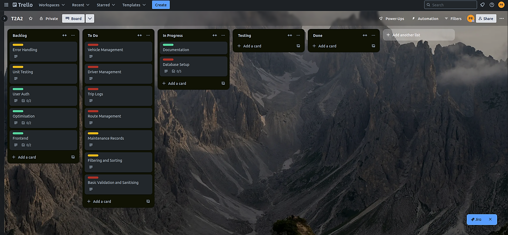

# FleetSentinel

## Mission Statement

FleetSentinel addresses inefficiencies in fleet management, focusing on centralising vehicle data and maintenance tracking. Australian fleets can lose up to $760 per day due to vehicle downtime, with unexpected breakdowns contributing significantly to this cost. Research shows that preventative maintenance can reduce downtime by 20%, further cutting operational costs.

The current version of FleetSentinel offers an API that streamlines the management of vehicle data and maintenance logs. It provides fleet managers with tools to track vehicle status, log maintenance activities, and ensure compliance with service schedules, reducing manual tracking errors. By automating these processes, FleetSentinel helps minimise unplanned downtime and maintenance-related disruptions, ensuring smoother operations without introducing advanced features like GPS tracking or predictive maintenance yet.

This solution is designed to improve fleet reliability and reduce downtime, giving businesses a solid foundation for scaling their operations while preparing for future enhancements like GPS integration and route optimisation.

#### *references*:
https://www.chevinfleet.com/en-au/learning-zone/the-real-cost-of-vehicle-downtime-for-your-fleet/

https://www.toyota.com.au/fleet/business-guide/total-cost-of-ownership

## Project Management

Tasks in the FleetSentinel project are planned using a structured approach that involves breaking down the development process into small, manageable tasks. These tasks are tracked using the project management tool, Trello. Each task is assigned a priority level and a due date, with progress tracked through stages such as 'To Do', 'In Progress', and 'Completed'.

### Initial Board

### During Project

### During Project 2

### Dependencies

### Database

The database system chosen for FleetSentinel is PostgreSQL, an open-source relational database management system. PostgreSQL offers several key benefits for the app’s data handling requirements.

PostgreSQL is ACID-compliant, ensuring reliable transactions, data integrity, and fault tolerance. This is essential for managing transactional data like vehicle logs and maintenance records, where consistency and accuracy are crucial. The system supports extensibility, enabling custom data types, functions, and operators. This flexibility is particularly useful in FleetSentinel, where non-standard data types like arrays, JSON, and custom structures are needed to store complex data. PostgreSQL’s Multi-Version Concurrency Control (MVCC) is another advantage. MVCC allows multiple users to access and update the database concurrently without locking issues, which is ideal when multiple fleet managers interact with the system simultaneously.

Another major strength is its support for advanced data types such as arrays, JSON, and hstore. These capabilities allow FleetSentinel to efficiently store and query complex data structures, such as vehicle metadata and real-time data logs. Additionally, PostgreSQL offers full-text search and spatial data support (PostGIS), both of which are useful for our applications need to handle route data or geographical information.

However, PostgreSQL’s rich set of features comes with some challenges. The database's performance overhead can become an issue when scaling to handle high volumes of transactions or complex queries. For example, in environments with high traffic or numerous simultaneous queries, performance tuning may be required to optimise the system. Furthermore, advanced configuration is often necessary to maintain optimal performance in large-scale systems. This includes fine-tuning memory settings, configuring replication for high availability, and setting up efficient caching systems. Without proper tuning, PostgreSQL can experience slower response times or become resource-heavy.

PostgreSQL also lacks native sharding, limiting its scalability across distributed systems. While third-party extensions like Citus can mitigate this, it adds an extra layer of complexity for maintaining a highly distributed architecture.

PostgreSQL is well-suited for FleetSentinel due to its reliability, flexibility, and powerful data-handling capabilities. However, as the system scales, performance tuning and potential use of third-party extensions will be necessary to manage its complexity and scale .

#### *references*

https://www.postgresql.org/docs/current/

https://www.citusdata.com/

https://www.postgresql.org/docs/current/mvcc.html

### ORM (Object-Relational Mapping System)

SQLAlchemy is the object-relational mapping system used in FleetSentinel. It connects Python applications to relational databases like PostgreSQL, allowing interactions using Python objects rather than raw SQL, simplifying the development process and improving maintainability.

#### Pros

SQLAlchemy abstracts database operations by mapping database tables to Python classes. This allows the management of complex relationships and queries without writing raw SQL. It also supports automatic schema generation based on Python class definitions, reducing manual errors when defining database structures. SQLAlchemy's flexibility in handling complex queries, joins, and relationships like "one-to-many" or "many-to-many" makes it suitable for applications like FleetSentinel.

Another advantage is its ability to manage transactions and concurrency. SQLAlchemy ensures data integrity across multiple users and processes through its session management and transaction handling features. Integration with web frameworks like Flask enables the efficient development of API-driven applications. SQLAlchemy also supports cross-database portability, allowing developers to switch between databases like PostgreSQL, MySQL, and SQLite with minimal changes to the codebase.

#### Cons

SQLAlchemy introduces performance overhead compared to writing raw SQL, especially in high-traffic or performance-sensitive environments. Complex queries and large datasets may result in inefficient query generation.

SQLAlchemy requires additional tools like Alembic to manage schema migrations, which adds complexity when frequent schema changes are needed. Debugging SQLAlchemy queries can also be challenging, as the abstraction may obscure performance issues that require closer inspection of the underlying SQL.

#### *references*

https://docs.sqlalchemy.org/en/20/faq/performance.html#sqlalchemy-faq-performance

https://docs.sqlalchemy.org/en/20/tutorial/index.html#unified-tutorial

https://docs.sqlalchemy.org/en/20/orm/session_basics.html

https://alembic.sqlalchemy.org/en/latest/

https://docs.sqlalchemy.org/en/20/core/

https://docs.sqlalchemy.org/en/20/core/connections.html#sql-compilation-caching

https://docs.sqlalchemy.org/en/20/dialects/

https://docs.sqlalchemy.org/en/20/orm/session.html

https://docs.sqlalchemy.org/en/20/orm/join_conditions.html

https://docs.sqlalchemy.org/en/20/orm/

   

### ERD (Entity Relationship Diagram)

##### Explanation

In the FleetSentinel system, the relationships between tables are designed to maintain both data integrity and efficiency in managing vehicles, drivers, routes, trips, and maintenance records. These relationships facilitate seamless data flow and support operations by linking related entities.

The relationship between the vehicles and drivers tables through the foreign key assigned_vehicle_id helps track which driver is assigned to a vehicle at any given time. This structure allows for efficient management of driver assignments, supporting queries to retrieve historical and current assignments, such as which drivers have been linked to specific vehicles.

In the trip_logs table, foreign keys tie together vehicles, drivers, and routes. This setup enables the tracking of every trip, including details such as the vehicle used, the driver, and the specific route. This structure provides a comprehensive view of fleet usage, facilitating the monitoring of vehicle performance, driver efficiency, and route effectiveness, all of which contribute to operational optimisation.

The connection between routes and trip_logs via route_id provides detailed insights into each route taken. This relationship is particularly useful for analysing metrics such as fuel efficiency or determining the most time-efficient routes, contributing to overall fleet optimisation.

The maintenance_records table is linked to both vehicles and drivers through foreign keys. This structure allows the tracking of the complete maintenance history of each vehicle, helping identify trends, such as vehicles that require more frequent repairs or patterns of driver behaviour that contribute to wear and tear. Additionally, maintenance costs can be tied to specific vehicles or trips, providing insights that aid in budget optimisation.

These relationships not only enforce data consistency but also enable the efficient retrieval, analysis, and management of fleet data. This structure supports better operational control and provides valuable insights into fleet performance and management.

#### How to interpret the Legend

The legend added to the FleetSentinel ERD explains the various notations and data types used in the diagram, clarifying how constraints and attributes are defined.

- Primary Key (pk): This marks the primary key of each table, which uniquely identifies every record. For example, vehicle_id in the vehicles table is the primary key, ensuring that each vehicle has a unique identifier.

- Foreign Key (fk): A foreign key creates a relationship between two tables by referencing the primary key of another table. In the drivers table, assigned_vehicle_id is a foreign key linking to vehicle_id in the vehicles table. This allows for connections between drivers and their assigned vehicles.

- Unique Constraint (unique): This ensures that values in a specific column are unique across the table. In the vehicles table, registration_number has a unique constraint, preventing any two vehicles from sharing the same registration number.

- Auto Increment (increment): This automatically increases the value of a field, typically a primary key, with each new record. For example, vehicle_id and driver_id are auto-incremented in the vehicles and drivers tables, ensuring new records receive unique IDs.

- Enum: This restricts the column to predefined values. For instance, in the vehicles table, status can only have values like 'active', 'maintenance', or 'decommissioned', ensuring consistent data entry.

- Timestamp (TIMESTAMP): Used for tracking when records are created or updated, created_at and updated_at fields record the timestamp of these events automatically.

- INT: Stores whole numbers, typically used for IDs and numeric values such as vehicle_id, mileage, or driver_id.

- VARCHAR: Stores strings up to a specified length, commonly used for text fields like make, model, and registration_number.

- DECIMAL: Stores precise numeric values, defined by precision and scale. For example, cost in the maintenance_records table is defined as DECIMAL(10, 2), meaning it stores numbers with up to 10 total digits, 2 of which are after the decimal point.

- FLOAT: Stores approximate decimal numbers with floating-point precision, such as the distance field in the routes table.

- DATE: Stores date values in the format of year, month, and day, such as license_expiry_date and maintenance_date.

- TEXT: Stores long, unstructured text, useful for fields like notes or description, where larger blocks of text might be needed.

- TIMESTAMP: Stores date and time information, tracking when records are created or updated, such as in created_at and updated_at.

### Implementation of the ERD